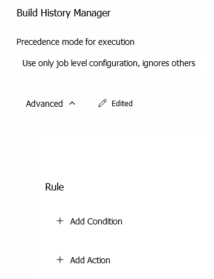
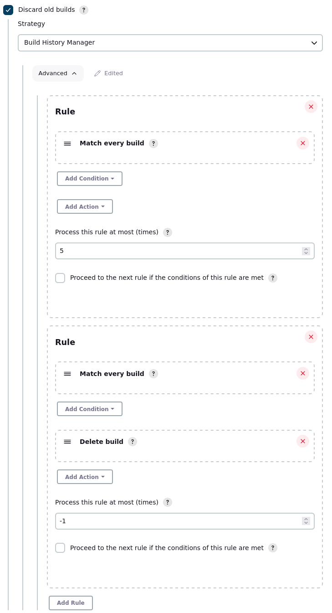

[](https://ci.jenkins.io/job/Plugins/job/build-history-manager-plugin/job/master/)
[](https://ci.appveyor.com/project/damianszczepanik/build-history-manager-plugin/branch/master)

[](https://codecov.io/gh/jenkinsci/build-history-manager-plugin)
[](https://sonarcloud.io/dashboard?id=damianszczepanik_build-history-manager-plugin)
[](https://app.snyk.io/org/damianszczepanik/project/aab2b0cc-41d6-41e7-a909-fbc9d09dc98d)
[](https://bestpractices.coreinfrastructure.org/en/projects/3370)

[](https://plugins.jenkins.io/build-history-manager)
[](https://github.com/jenkinsci/build-history-manager-plugin/releases)

# Build History Manager Plugin

This [Jenkins](https://jenkins.io/) plugin enables you to create simple yet powerful rules to control build retention
and cleanup. Rules use conditionals to filter completed builds from your history and actions to retain or delete the
selected builds.

Rules evaluate completed builds using conditionals to filter the build history, then trigger actions on the matching
builds.

## Rules

Users can add Build History Manager rules to each Jenkins jobs. The rules are composed of following object:

1. Built-in Conditions: Control whether
   a [Rule](./src/main/java/pl/damianszczepanik/jenkins/buildhistorymanager/model/Rule.java) applies to a given build.
2. [Condition](./src/main/java/pl/damianszczepanik/jenkins/buildhistorymanager/model/conditions/Condition.java)s
   evaluate combined criteria (using logical AND) to filter and select builds.
3. [Action](./src/main/java/pl/damianszczepanik/jenkins/buildhistorymanager/model/actions/Action.java)s execute on
   matching builds when all rule conditions are satisfied.

### Built-in conditions

The plugin uses three mandatory built-in conditions to control execution flow. One condition is applied to all rules by
the plugin, while the other two are configurable on a per-rule basis.

The built-in conditions are:

1. __Keep Forever Check__: Checks the "Keep this build forever" attribute for the build. If enabled, rules are not
   applied to it, protecting it from automated plugin actions.
2. `matchAtMost` Counter: Limits the maximum number of times a rule can be applied ("Process this rule at most (times)"
   in the UI). The default is -1 (unlimited).
3. `continueAfterMatch` Flag: Determines whether evaluation proceeds to the next rule for the current build once this
   rule matches ("Proceed to the next rule if the conditions of this rule are met" in the UI). The default is true.

### Global configuration

The plugin supports a global configuration that enables DevOps teams and administrators to manage retention policies at
the top-level directory. This approach allows a single configuration to be applied uniformly across all Jenkins jobs.



### Optional Conditions

Users can add
multiple [Condition](./src/main/java/pl/damianszczepanik/jenkins/buildhistorymanager/model/conditions/Condition.java)s
to a rule in any order. Conditions are evaluated sequentially in the order they are defined. The conditions are:

- [Build age range](./src/main/java/pl/damianszczepanik/jenkins/buildhistorymanager/model/conditions/BuildAgeRangeCondition.java)
- [Build cause](./src/main/java/pl/damianszczepanik/jenkins/buildhistorymanager/model/conditions/CauseCondition.java)
- [Build number range](./src/main/java/pl/damianszczepanik/jenkins/buildhistorymanager/model/conditions/BuildNumberRangeCondition.java)
- [Build result](./src/main/java/pl/damianszczepanik/jenkins/buildhistorymanager/model/conditions/BuildResultCondition.java)
- [Match every build](./src/main/java/pl/damianszczepanik/jenkins/buildhistorymanager/model/conditions/MatchEveryBuildCondition.java)
- [Token Macro](./src/main/java/pl/damianszczepanik/jenkins/buildhistorymanager/model/conditions/TokenMacroCondition.java)

Assuming the built-in conditions pass, optional conditions evaluate as follows:

1. If any condition fails: The rule's actions are skipped.
2. If all conditions pass: The rule's actions are executed on the build.
3. If no conditions are defined: The rule's actions are executed automatically.

### Optional Actions

- [Change build description](./src/main/java/pl/damianszczepanik/jenkins/buildhistorymanager/model/actions/ChangeBuildDescriptionAction.java)
- [Delete artifacts](./src/main/java/pl/damianszczepanik/jenkins/buildhistorymanager/model/actions/DeleteArtifactsAction.java)
- [Delete build](./src/main/java/pl/damianszczepanik/jenkins/buildhistorymanager/model/actions/DeleteBuildAction.java)
- [Delete log file](./src/main/java/pl/damianszczepanik/jenkins/buildhistorymanager/model/actions/DeleteLogFileAction.java)

Delete actions should be placed last in the list. While preceding actions will still execute if a delete action comes
first, any subsequent actions will be rendered ineffective.

## Operation

The plugin iterates through completed builds from most recent to oldest. For each build, it evaluates the rules
sequentially from top to bottom until execution stops or all rules have been processed.

The plugin evaluates builds using the following execution loop:

1. __Traverse Builds__: Iterate through completed builds from newest to oldest.
   __Keep Forever Check__: If the build is marked "Keep this build forever", skip it entirely and proceed to the next
   build.
2. __Evaluate Rules__: For each eligible build, process rules sequentially top-to-bottom:
    1. __Limit Check__: If the rule's match counter equals matchAtMost, skip to the next rule.
    2. __Condition Check__: Evaluate optional conditions (if any).
        1. If all conditions match (or none are specified):
            1. Increment the rule's match counter by 1.
            2. Execute all configured actions in order.
            3. If continueAfterMatch is true: Proceed to evaluate the next rule on this same build.
            4. If continueAfterMatch is false: Stop evaluating rules for this build and jump to the next completed
               build.
        2. If any condition fails: Skip actions and proceed to evaluate the next rule on this build.

__Notes__:

1. Disabling Rules (`matchAtMost` = 0): Setting matchAtMost to 0 effectively disables a rule without deleting its
   configuration. Once a rule reaches its defined limit, it is skipped in all future evaluations.
2. Unconditional Execution (No Conditions): Defining a rule with no conditions will automatically execute its actions on
   every processed build (e.g., to purge all historical builds). Use with caution. 3.Safe No-Op Handling (No Actions):
   Defining a rule with no actions acts as a filter to ignore specific builds and protect them from subsequent rules.
4. Post-Deletion Handling: While continuing rule evaluation after a build has been deleted is usually unnecessary, the
   plugin handles this safely without throwing errors.

## Use cases

- __Purge Low-Value Runs__: Automatically
  delete  [unstable](https://javadoc.jenkins.io/hudson/model/Result.html#UNSTABLE)
  or [aborted](https://javadoc.jenkins.io/hudson/model/Result.html#ABORTED) builds that no longer provide value.
- __Result-Based Retention__: Retain only the most recent `N` builds for specific build statuses (e.g., Keep the last 3
  Aborted, Unstable, Failure, or Success builds).
- __Branch-Specific Policies__: Limit long-term build retention exclusively to the master branch when job pipelines
  build both main and feature branches.
- __Bulk Legacy Cleanup__: Discard all legacy builds with
  a[build number](https://javadoc.jenkins-ci.org/hudson/model/Run.html#getNumber--) below a specific threshold in a
  single operation.

## Examples

### Keep 5 most recent builds, delete the rest

The following configuration retains the 5 most recent builds while deleting all older build history:



### Retain most recent failed build

The following configuration retains the most recent broken build and all stable builds. The first rule protects the
latest build with a Failure [result](https://javadoc.jenkins-ci.org/hudson/model/Result.html) from deletion, while the
second rule purges all remaining builds that did not succeed.

```groovy
pipeline {
    agent any

    options {
        buildDiscarder(BuildHistoryManager([
                [
                        conditions        : [
                                BuildResult(matchFailure: true)
                        ],
                        matchAtMost       : 1,
                        continueAfterMatch: false
                ],
                [
                        conditions: [
                                BuildResult(matchNotBuilt: true, matchAborted: true, matchFailure: true, matchUnstable: true)
                        ],
                        actions   : [DeleteBuild()]
                ]
        ]))
    }

    stages {
        stage('Demo') {
            steps {
                echo "Hello!"
            }
        }
    }
}
```

### Remove builds based on a job parameter

The following configuration uses three rules to preserve the last 24 builds where `ENABLE_HISTORY` is set to "true". The
first rule uses a Token Macro Condition to identify and remove builds where `ENABLE_HISTORY` equals "false". The second
rule protects the 24 most recent remaining builds, and the third rule purges any builds beyond that threshold.

```groovy
pipeline {
    agent any

    options {
        buildDiscarder(BuildHistoryManager([
                [
                        conditions        : [
                                TokenMacro(template: '"${ENABLE_HISTORY}"', value: '"false"')
                        ],
                        actions           : [DeleteBuild()],
                        continueAfterMatch: false
                ],
                [
                        matchAtMost       : 24,
                        continueAfterMatch: false
                ],
                [
                        actions: [DeleteBuild()]
                ]
        ]))
    }

    parameters {
        booleanParam(
                name: 'ENABLE_HISTORY',
                defaultValue: true,
                description: 'Check to preserve build.'
        )
    }

    stages {
        stage('Demo') {
            steps {
                echo "Hello!"
            }
        }
    }
}
```

## Wiki

Refer to the [Wiki](https://github.com/jenkinsci/build-history-manager-plugin/wiki) for more detailed information and
advanced configurations. Additionally, review the Rule Creation Guidance to
help [avoid common](https://github.com/jenkinsci/build-history-manager-plugin/wiki/Building-good-rules) pitfalls and
unexpected behavior when designing retention policies.

The Build History Manager plugin allows you to define complex rules containing multiple conditions and actions
per [rule](./src/main/java/pl/damianszczepanik/jenkins/buildhistorymanager/model/Rule.java). The plugin integrates
directly with Jenkins core via
the [BuildHistoryManager](./src/main/java/pl/damianszczepanik/jenkins/buildhistorymanager/BuildHistoryManager.java)
class, which extends [BuildDiscarder](https://javadoc.jenkins.io/jenkins/model/BuildDiscarder.html). At the execution
layer, the  [Rule.perform()](./src/main/java/pl/damianszczepanik/jenkins/buildhistorymanager/model/Rule.java) method
acts as the primary engine for evaluating rule conditions and dispatching corresponding actions.

## Troubleshooting

The plugin is called by the Jenkins core when the build is completed. It is not tied to any particular run such as the
last completed run, which could potentially be deleted by certain actions. To assist with troubleshooting and analysis,
the plugin logs helpful messages to
the [Jenkins logs](https://www.jenkins.io/doc/book/system-administration/viewing-logs/).

## Test & debug

For debugging purposes, you can use the
[ChangeBuildDescriptionAction](./src/main/java/pl/damianszczepanik/jenkins/buildhistorymanager/model/actions/ChangeBuildDescriptionAction.java)
action. This action allows you to update the build description, making it convenient to test and debug conditions before
applying actual deletions as actions.

Use
the [ChangeBuildDescriptionAction](./src/main/java/pl/damianszczepanik/jenkins/buildhistorymanager/model/actions/ChangeBuildDescriptionAction.java)
to safely test and debug your rules. This action updates the build description, letting you verify that conditions match
the intended builds before applying deletion actions.

## Code quality

When developed a new feature or improvement, it is essential to conduct thorough testing by implementing multiple
[unit](https://en.wikipedia.org/wiki/Unit_testing) or [integration](https://en.wikipedia.org/wiki/Integration_testing)
tests. This ensures the reliability and functionality of the implemented changes.


## Release notes

Check [release notes](https://github.com/jenkinsci/build-history-manager-plugin/releases).

## Contribution

If you discover an issue or need a missing `action` or `condition`, we welcome your contributions. You can help improve
the plugin by filing a detailed bug report or submitting a pull request with your proposed fix or enhancement. When
contributing code, please remember to include comprehensive tests and update relevant documentation to support your
changes.

- Conduct tests on your local Jenkins instance to ensure the changes work as expected.
- Include new unit tests following
  the [given -> when -> then](https://pl.wikipedia.org/wiki/Behavior-driven_development) approach to verify the behavior
  of the changes.
- Remember to perform integration tests to ensure the changes integrate smoothly with the overall system.
- Update the wiki documentation to reflect the changes made.
