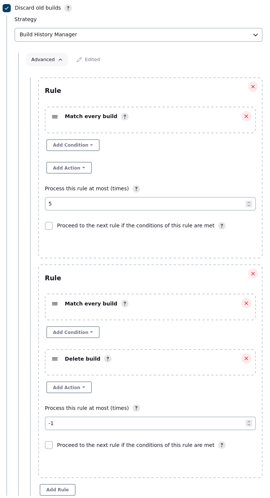

[](https://travis-ci.org/jenkinsci/build-history-manager-plugin)
[](https://ci.appveyor.com/project/damianszczepanik/build-history-manager-plugin/branch/master)
[](https://app.shippable.com/github/jenkinsci/build-history-manager-plugin/dashboard)

[](https://codecov.io/gh/jenkinsci/build-history-manager-plugin)
[](https://codebeat.co/projects/github-com-jenkinsci-build-history-manager-plugin-master)
[](https://www.codacy.com/manual/damianszczepanik/build-history-manager-plugin)
[](https://app.snyk.io/org/damianszczepanik/project/aab2b0cc-41d6-41e7-a909-fbc9d09dc98d)
[](https://bestpractices.coreinfrastructure.org/en/projects/3370)

[](https://plugins.jenkins.io/build-history-manager)
[](https://github.com/jenkinsci/build-history-manager-plugin/releases)

# Build History Manager Plugin
[Jenkins](https://jenkins.io/) plugin that allows to build complex rules to define which builds should be removed from the history and which preserved.

## Usage
The motivation of creating this plugin is to deliver powerful tool that allows to define rules that are built from two types of objects:

### Example
Following configuration has two rules. First one makes sure that the newest build with `failure` status is not deleted.
Second deletes all builds which are not `success`. In other words it keeps the most recent broken build and all stables.
```groovy
pipeline {
   agent any

    options {
        buildDiscarder(BuildHistoryManager([
            [
                conditions: [
                    BuildResult(matchFailure: true)
                ],
                matchAtMost: 1,
                continueAfterMatch: false
            ],
            [
                conditions: [
                    BuildResult(matchAborted: true, matchFailure: true, matchUnstable: true)
                ],
                actions: [DeleteBuild()]
            ]
        ]))
    }
}
```

### Conditions
Following simple configuration allows to save last 5 builds, rest will be deleted:
[Condition](./src/main/java/pl/damianszczepanik/jenkins/buildhistorymanager/model/conditions/Condition.java) filters out builds which should be performed by [actions](./src/main/java/pl/damianszczepanik/jenkins/buildhistorymanager/model/actions/Action.java). So plugin can filter builds by:
- build [result](https://javadoc.jenkins-ci.org/hudson/model/Result.html)
- variables for which you can use [Token Macro](https://plugins.jenkins.io/token-macro) plugin

### Actions
[Actions](./src/main/java/pl/damianszczepanik/jenkins/buildhistorymanager/model/actions/Action.java) defines how the build filtered by above condition) should be modified. Plugin can:
- mark the build to be [kept forever]([https://javadoc.jenkins.io/hudson/model/Run.html#keepLog--)
- [delete](https://javadoc.jenkins.io/hudson/model/Run.html#delete--) the build
- [delete](https://javadoc.jenkins.io/hudson/model/Run.html#deleteArtifacts--) artifacts

### Wiki
Read [Wiki](https://github.com/jenkinsci/build-history-manager-plugin/wiki) for more details.

There is possibility to build complex rules. Each [rule](./src/main/java/pl/damianszczepanik/jenkins/buildhistorymanager/model/Rule.java) can define more than single condition and action.
Plugin starts as [BuildDiscarder](https://javadoc.jenkins.io/jenkins/model/BuildDiscarder.html) class. Core method that is responsible for processing conditions and actions are stored in [Rule.perform()](./src/main/java/pl/damianszczepanik/jenkins/buildhistorymanager/model/Rule.java) method.

### Configuration


### Use cases
Using conditions and actions there is easy to realize following scenarios:
- Delete builds which are [unstable](https://javadoc.jenkins.io/hudson/model/Result.html#UNSTABLE) or [aborted](https://javadoc.jenkins.io/hudson/model/Result.html#ABORTED) if they are not valuable from the history/audit point of view.
- Keep only last build per [result](https://javadoc.jenkins.io/hudson/model/Result.html). So the history contain the most recent builds for result aborted, unstable, failure and success.
- Keep builds only from `master` branch if the project builds all branches including feature branches
- Remove builds which have [build number](https://javadoc.jenkins-ci.org/hudson/model/Run.html#getNumber--) lower than given value to easily drop all old builds at once.

## Code quality
Once you developed your new feature or improvement you should test it by providing several [unit](https://en.wikipedia.org/wiki/Unit_testing) or [integration](https://en.wikipedia.org/wiki/Integration_testing) tests.


## Release notes
Check [release notes](https://github.com/jenkinsci/build-history-manager-plugin/releases) for changelog details.

## Contribution
If you find the issue you can send pull request to fix it or file the bug.
The same about missing <code>Action</code> or <code>Condition</code>
Remember about:
- doing tests on your local Jenkins instance
- adding new unit tests according to [given -> when -> then](https://pl.wikipedia.org/wiki/Behavior-driven_development) approach.
